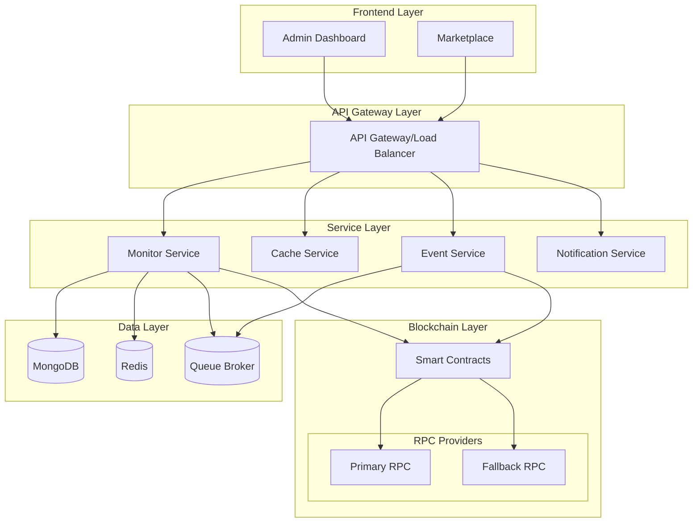

# Arquitetura do Sistema RWA Hub

## Visão Geral
Sistema distribuído para tokenização e gerenciamento de ativos reais (RWA) na blockchain.

## Componentes Principais

### 1. Frontend Layer
- **Admin Dashboard**: Gerenciamento de tokens, compliance e usuários
- **Marketplace**: Interface para usuários finais, trading e visualização

### 2. API Gateway Layer
- Load balancing
- Rate limiting
- Request routing
- Authentication/Authorization

### 3. Service Layer
- **Monitor Service**: 
  - Indexação de eventos
  - Processamento de transações
  - Monitoramento da blockchain
- **Cache Service**:
  - Caching de dados frequentes
  - Estado temporário
  - Session management
- **Event Service**:
  - Processamento assíncrono
  - Event sourcing
  - Webhooks
- **Notification Service**:
  - Alertas
  - Emails
  - Push notifications

### 4. Data Layer
- **MongoDB**: Dados persistentes
- **Redis**: Cache e estado temporário
- **Queue Broker**: Mensageria assíncrona

### 5. Blockchain Layer
- **Smart Contracts**: Lógica de negócio on-chain
- **RPC Providers**: Conexão com a blockchain
  - Sistema de fallback
  - Load balancing
  - Circuit breakers

## Fluxos Principais

### 1. Fluxo de Tokenização
1. Admin inicia tokenização
2. Validação off-chain
3. Preparação de metadados
4. Deploy de contratos
5. Indexação e cache
6. Notificação de stakeholders

### 2. Fluxo de Trading
1. Usuário inicia trade
2. Validação de compliance
3. Verificação de saldo/allowance
4. Execução da transação
5. Monitoramento de confirmação
6. Atualização de cache
7. Notificação de conclusão

### 3. Fluxo de Eventos
1. Monitor detecta evento
2. Envia para fila
3. Processamento assíncrono
4. Atualização de cache
5. Notificação se necessário

## Considerações de Segurança

1. **Smart Contracts**
   - Upgradability segura
   - Timelock para mudanças críticas
   - Multi-sig para admin actions

2. **API Security**
   - JWT com rotação
   - Rate limiting
   - CORS configurado
   - Validação de input

3. **Data Security**
   - Encryption at rest
   - Backup strategy
   - Access control

## Monitoramento

1. **Métricas**
   - Gas prices
   - Transaction success rate
   - API latency
   - Cache hit ratio

2. **Alertas**
   - Falhas de transação
   - Gas spikes
   - API errors
   - Contract events críticos

3. **Logs**
   - Transaction traces
   - Event logs
   - Error tracking
   - Audit trail

## Próximos Passos

1. **Fase 1: Infraestrutura Base**
   - Setup Redis
   - Implementar API Gateway
   - Configurar monitoramento

2. **Fase 2: Escalabilidade**
   - Sharding MongoDB
   - Load balancing
   - Cache distribution

3. **Fase 3: Resiliência**
   - Circuit breakers
   - Fallback systems
   - Disaster recovery

4. **Fase 4: Otimização**
   - Performance tuning
   - Gas optimization
   - Cache strategies 